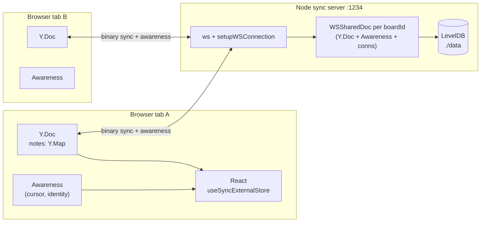

# Trailboard — architecture walkthrough

A guide to the system, written to be talked through out loud. Each section leads
with the claim you'd make, then the detail to back it up if someone digs.

---

## 1. The one-paragraph version

Trailboard is a collaborative sticky-note board. Each board is a Yjs CRDT document
identified by the URL; a Node WebSocket server relays updates between everyone in
that room and streams them to LevelDB so the board survives a restart. The server
holds no application logic and never resolves a conflict — merging happens
identically inside every client, which is the property that makes offline editing
and reconnection work without any reconciliation code.

---

## 2. Topology



Three things to notice:

- The server has **one document per room**, keyed by the WebSocket path.
- Awareness rides the **same socket** but is a **separate protocol** from document
  sync, and never touches LevelDB.
- The client's Y.Doc is the source of truth for the UI. React is a rendering layer
  subscribed to it, not a state owner.

---

## 3. The sync flow (the part interviewers care about)

### What a Yjs document actually is

A Yjs document is a set of operations, each stamped with `(clientID, clock)`. Yjs
implements an optimised variant of **YATA**, a sequence CRDT: every inserted item
records what it was inserted after, and a deterministic tie-break orders
concurrent inserts at the same position. Because ordering is a pure function of
the operations, two peers holding the same set of operations compute the same
document, regardless of arrival order.

That gives updates three properties that the rest of the design leans on:

- **Commutative** — order of application doesn't matter.
- **Idempotent** — applying the same update twice is a no-op.
- **Associative** — you can merge in any grouping.

### A state vector, not a version number

A state vector is a map of `clientID → clock`: "I have seen the first *n*
operations from client *x*." It is the compact summary of what a peer knows,
proportional to the number of distinct editors rather than the size of the board.

### The handshake, message by message

On connect, `setupWSConnection` sends **sync step 1** containing the server's
state vector. The client's `readSyncMessage` replies with **sync step 2** — an
update containing exactly the operations the server is missing — and sends its own
step 1 in the other direction. From then on both sides exchange **update**
messages. The three message types are literally `0`, `1`, `2` in
`y-protocols/sync`.

```
client                                   server
  │                                        │
  │  ◀──────── sync step 1 (SV_server) ────│   "here's what I have"
  │                                        │
  │──── sync step 2 (ops server lacks) ───▶│   "here's what you're missing"
  │──── sync step 1 (SV_client) ──────────▶│   "here's what I have"
  │                                        │
  │  ◀──────── sync step 2 (ops I lack) ───│
  │                                        │
  │  ◀═══════ update / update / update ═══▶│   steady state
```

**Be precise about cost.** A *reconnecting* client receives only what it missed,
which is the real win. A *first-time* visitor still receives the whole current
state — but that's the compacted state, not the edit history, because Yjs garbage
collects the content of deleted items and keeps only compact tombstones.

### The server is a relay

`updateHandler` in `y-websocket/bin/utils.js` takes any update applied to the room
document and forwards the bytes to every connection in the room — including the
one that sent it, which is harmless precisely because applying an update twice is
a no-op. The server never inspects a note, never resolves a conflict, and has no
schema. Two consequences worth stating:

- **Offline works for free.** A disconnected client keeps editing its local Y.Doc.
  On reconnect, the state-vector exchange transfers both directions and both sides
  converge. No merge endpoint, no conflict UI, no "someone else edited this" modal.
- **Scaling out is the hard part, not merging.** Rooms are in-process memory, so
  two server instances would each hold their own copy of a room and never see each
  other's updates. Horizontal scale needs either sticky routing by boardId or a
  pub/sub layer between instances.

---

## 4. Data model: conflict granularity is a schema decision

This is the highest-signal design point in the project.

```
Y.Doc
└── "notes"            Y.Map<string, Y.Map>       ← add / remove a note
    └── <noteId>       Y.Map                      ← per-field LWW
        ├── x          number
        ├── y          number
        ├── color      string  (name, never a hex)
        ├── createdAt  number
        └── text       Y.Text                     ← per-character merge
```

Three levels, three different merge behaviours, chosen deliberately:

| Level | Structure | Concurrent edits resolve as |
| --- | --- | --- |
| Board | `Y.Map` of notes | Add/remove, independent per key |
| Note | Nested `Y.Map` | Last-write-wins **per field** |
| Body | `Y.Text` | Character-level interleave |

**Why nested `Y.Map` instead of a plain object.** If a note were a plain JS object
stored as a map value, writing any field would replace the whole value. Drag a note
while someone recolours it and one edit is destroyed. With a nested map, `x`/`y`
and `color` are independent keys and both survive. This is verified by a test that
performs both edits concurrently from two browsers.

**Why `Y.Text` for the body.** A textarea hands you a finished string, but a CRDT
needs the *operation*. Assigning the whole string on every keystroke would delete
and reinsert every character, wiping a collaborator's concurrent edits and their
caret. `applyTextDiff` strips the common prefix and suffix and touches only the
span between, which covers typing, backspacing, pasting, and replacing a
selection. The test proves convergence: from `HELLO`, one tab typing `aaa` at the
start while the other types `bbb` at the end yields `aaaHELLObbb` in both, all 11
characters intact.

**Why the colour is a name, not a hex value.** `color: "sage"` keeps the palette a
presentation concern. Restyling later doesn't require rewriting every note already
on disk.

---

## 5. Awareness: deliberately *not* a CRDT

Cursors and identity go through `y-protocols` Awareness, not the document.

The argument in one line: **a CRDT keeps history so it can merge, which is exactly
wrong for a pointer position.** Only the latest value matters, and stale values
should disappear on their own.

Mechanically, awareness is a per-client state map with a monotonic `clock` per
client — higher clock wins, so it's last-write-wins per client with no merge. Each
client renews its own entry every 15s, and any client not heard from within 30s is
swept (checked every 3s). The server also calls `removeAwarenessStates` when a
socket closes, which is what makes an avatar vanish immediately rather than after
the timeout.

Nothing about awareness is persisted. Putting cursors in the Y.Doc would grow the
document forever and write every mouse twitch to LevelDB.

**Coordinate space is the subtle bit.** Cursors are broadcast in board-canvas
coordinates, not viewport coordinates. Viewport pixels would put a peer's cursor in
the wrong place the moment two windows differed in size or scroll offset. There's a
test that scrolls one tab 300px and asserts the peer cursor holds its board
coordinate while shifting 300px on screen.

---

## 6. Persistence: append then compact

- Every update is appended to LevelDB as it arrives — cheap, on the hot path.
- When the last client leaves a room, `flushDocument` collapses the append-only log
  into a single snapshot so the next hydrate is fast and the folder stays bounded.
- Hydration merges in both directions: disk state into the live doc, and live state
  into disk. Because updates are commutative and idempotent, doing both is safe and
  order-independent — you get the union, not a last-write-wins overwrite.

### The bug worth telling as a story

The first version lost data, and the smoke test caught it: a note written
immediately after connecting vanished on restart while a later note survived.

`getYDoc` calls `bindState` **without awaiting it**, and `setupWSConnection` starts
syncing the client on the very next line. So a client can connect, sync, and write
while `bindState` is still awaiting its read from disk. The reference
implementation in `y-websocket` subscribes to the document's `update` event *after*
those awaits, so anything landing in that window is applied to memory and never
written to disk.

The fix is to subscribe synchronously as the first statement in `bindState`, before
any `await`, then reconcile with disk afterwards. Updates replayed during hydration
are tagged with an origin symbol so the handler skips its own echo.

This is a good answer to "tell me about a bug you found," because it's a race in a
widely used library's reference code, and the reasoning is entirely about
await-point analysis.

---

## 7. Client architecture

### Bridging Yjs into React

`useSyncExternalStore` is the hook designed for state that lives outside React and
changes without React knowing. The one trap: the snapshot must be **referentially
stable**. Returning a fresh array on every call makes React think the store changed
on every render and loop forever. Every hook here recomputes once per Yjs event and
returns the same reference until the next one.

### Subscription granularity matches mutation granularity

This is the performance thesis of the client.

| Hook | Subscribes to | Fires on |
| --- | --- | --- |
| `useNoteIds` | root map, `observe` | note added / removed only |
| `useNote(id)` | that note's map, `observeDeep` | that note's fields and text |
| `useCanvasExtent` | root map, `observeDeep` | quantised to 480px steps |
| `usePresenceUsers` | awareness `change` | roster changes only |
| `useRemoteCursors` | awareness `change` | every cursor movement |

Dragging a note re-renders exactly one component. `observe` rather than
`observeDeep` on the root is the load-bearing detail — `observeDeep` there would
re-render the entire board on every frame of every drag. The canvas size is
quantised so the container keeps its snapshot identity until it crosses a step
boundary, and React skips the render entirely.

### Session lifecycle

The Y.Doc, provider, and awareness are created and destroyed together in a single
effect keyed on `boardId`. Two reasons: a Y.Doc accumulates state permanently, so
reusing one across boards would leak notes between them; and StrictMode mounts,
unmounts, and remounts everything in dev, where a partial teardown would leave a
second live socket and duplicate every change.

`provider.destroy()` only *unsubscribes* from an awareness instance it didn't
create, so supplying our own means destroying it ourselves.

---

## 8. Performance decisions

- **Writes coalesced to one per animation frame.** Pointer events outpace the
  display, and each write is a CRDT update plus a WebSocket frame. Both note
  dragging and cursor broadcast use a `requestAnimationFrame` gate: roughly 60
  messages/sec instead of several hundred, with no visible difference. Drag flushes
  the pending position on pointer-up so the released position is never stale.
- **Drag tracks pointer deltas, not element geometry.** No `getBoundingClientRect`
  on the hot path, and a scroll or resize mid-drag can't make the note jump.
- **The cursor trail fades in CSS, not React.** Each dot animates 0.6 → 0 over its
  own 400ms lifetime. Dots are rationed by distance *and* elapsed time, so the
  0.6→0.1 ramp emerges from their ages rather than being recomputed per frame.
  React runs about 12 times a second per moving cursor instead of 60.

### A second bug worth telling

The trail initially rendered nothing. The buffer was being advanced inside a
`setState` updater, and React 19 StrictMode **double-invokes updaters** in
development: the second pass saw the position the first had just recorded,
measured zero travel, and dropped every dot. Updaters must be pure; side effects
belong in the effect body. Good answer to "what's a subtle React bug you've hit."

---

## 9. Failure modes

| Scenario | Behaviour |
| --- | --- |
| Server restarts | Clients reconnect with backoff; state vectors re-exchange; board restored from LevelDB |
| Client goes offline | Keeps editing locally; converges on reconnect |
| Two users edit different fields of one note | Both survive (nested map) |
| Two users type in one note | Character-level interleave (`Y.Text`) |
| Two users drag the same note | Last writer wins on `x`/`y` — inherent to LWW, and the right trade-off for a position |
| Peer's tab crashes | Awareness sweeps them after 30s; a clean close removes them instantly |
| Malformed board id | Rejected at the HTTP upgrade, before any document is created |

---

## 10. Known limits, and what I'd do next

Being able to name these is worth more than pretending they don't exist.

- **No auth.** Anyone with a board id can read and write it. Board ids are
  unguessable-ish (10 chars, 32-symbol alphabet ≈ 50 bits) but that's obscurity,
  not access control.
- **No horizontal scale.** Rooms live in process memory. Needs sticky routing by
  boardId or pub/sub between instances.
- **No rate limiting.** A malicious client can flood updates and grow the document
  unboundedly.
- **Marker colours can collide.** Assigned randomly per session from five colours,
  so two people occasionally draw the same colour. Fixable by picking the least-used
  colour from current awareness state at join.
- **No note z-ordering.** Overlapping notes are stacked by creation time, with no
  way to bring one to the front.
- **LevelDB is single-process.** It takes an exclusive directory lock, which is
  another thing that blocks running two server instances.

---

## 11. Questions you should expect

**"Why a CRDT instead of OT?"**
Operational Transformation needs a central authority to sequence and transform
operations — the server becomes stateful and correctness-critical. A CRDT pushes
merging to the edges, so the server is a dumb relay and offline editing works
without special handling. The trade-off is metadata: CRDTs carry per-operation
identity and tombstones, so the document is larger than the visible text.

**"What happens if two people drag the same note at once?"**
Last writer wins on `x` and `y`, because position is a register, not a sequence.
That's the correct behaviour — you can't meaningfully merge two positions. What
matters is that a concurrent *recolour* isn't destroyed, which the nested-map
schema guarantees.

**"How does a new client catch up?"**
State vector exchange. Sync step 1 carries "what I've seen" as `clientID → clock`;
the peer replies with only the operations missing from that. A reconnecting client
gets just the delta; a first-time visitor gets the current compacted state.

**"Why isn't the cursor in the document?"**
It's ephemeral, last-write-wins-per-client state with no history and automatic
expiry — the opposite of what a CRDT is for. Awareness is a separate protocol on
the same socket, never persisted.

**"How do you stop the board re-rendering on every mouse move?"**
Subscribe at the granularity you mutate at. Root map with `observe` for the note
list, per-note `observeDeep` for fields, and a roster-diffing snapshot so the
presence bar ignores cursor movement entirely.

**"What would you do differently?"**
Put a pub/sub layer between server instances from the start rather than assuming
one process, and add auth before anything else. I'd also consider storing note
positions relative to a fixed board coordinate system with an explicit zoom level,
which the current absolute-pixel model would need before adding pan/zoom.
